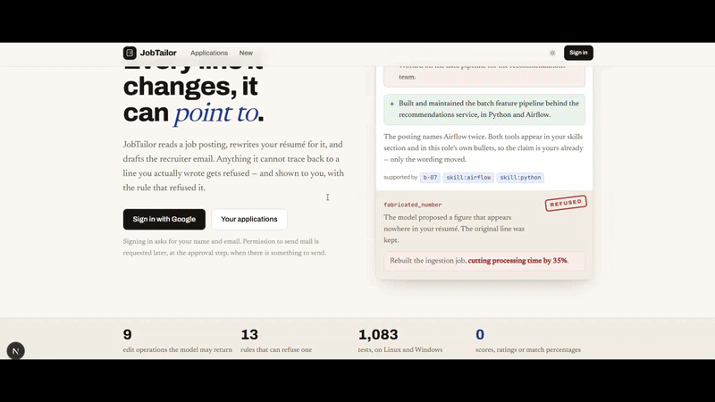

# JobTailor

[](https://github.com/HOORIAGABA/jobtailor/actions/workflows/ci.yml)

**Résumé tailoring that can prove it didn't invent anything.**

**▶ [Live demo (read-only)](https://jobtailor-h9cs.vercel.app)** ·
[Architecture](docs/ARCHITECTURE.md) · [Decisions and the bugs behind them](docs/DECISIONS.md) ·
[Run it yourself](DEMO.md)



Give it a job posting and your résumé. It studies the role, rewrites the résumé
for it, drafts the recruiter email — and shows you every change, its reason, and
the line of your own résumé it came from. Nothing is sent until you have read the
exact text and approved it.

The one thing it will not do is invent. If the posting wants Kubernetes and your
résumé has never mentioned Kubernetes, it reports a gap. It does not quietly add
"exposure to Kubernetes" to your skills. **That refusal is enforced by
deterministic Python, not by asking a model nicely** — and the architecture
exists to make it checkable.

---

## What that looks like

A real refusal, from the `fabricated_number` eval case. The writer proposed a
statistic; the validator could not find it in the source; the original line was
kept and the refusal is shown rather than swallowed:

```
rewrite_bullet   experience · b-07

  − Worked on the data pipeline for the recommendations team.
  + Built and maintained the batch feature pipeline behind the
    recommendations service, in Python and Airflow.

  The posting names Airflow twice. Both tools appear in your skills section
  and in this role's own bullets, so the claim is yours already.
  supported by  b-07 · skill:airflow · skill:python

──────────────────────────────────────────────────────── REFUSED ──
fabricated_number
  The model proposed a figure that appears nowhere in your résumé.
  The original line was kept.

  Rebuilt the ingestion job, cutting processing time by 35%.
```

A refusal you cannot see is a refusal you cannot check, so every one of them is
rendered on the approval screen with the rule that produced it.

### Five applications you can open right now

The [live demo](https://jobtailor-h9cs.vercel.app/app) holds one fictional
candidate's résumé tailored to five AI roles. Each shows a different thing the
guard does:

| Role | What the review screen shows |
| --- | --- |
| Junior AI Engineer | an invented "30%" accuracy figure refused — `fabricated_number` |
| ML Engineer, NLP | "Fine-tuned" rewritten as "Led the fine-tuning", refused — `seniority_escalation` |
| LLM Application Developer | FAISS swapped for Pinecone, a tool she never used, refused — `unsupported_entity` |
| Data Scientist | a tool list glued onto a real bullet, refused — `keyword_stuffing` |
| Python Backend Engineer | nothing refused: the honest case, where good edits go straight through |

Each one also shows the gaps it left alone, the three-grade standing, the drafted
email and the tailored PDF. The model's answers in these five are recorded and
replayed; the matching, every refusal, the diff, the email checks and the PDF
are computed by the real engine, and every page says so. `scripts/showcase.py`
refuses to seed a case that fails its own checks, and CI runs the same checks.

---

## The one idea

```
tailored = base + validated operations
```

The obvious design sends the résumé and the posting to a model and takes a better
résumé back. That design cannot be checked: you have two blobs of text and no way
to know whether the "3 years" in the new one came from the old one.

So **the model never returns a résumé.** It returns typed edit operations —
`rewrite_bullet` with an id, a rationale and citations; `flag_gap` with a
requirement — and a deterministic validator checks each one against the original
document before anything is applied.

Nine operation kinds. Thirteen ways to refuse one. Four properties fall out of the
data model for free:

- **attribution** — every change is an object carrying its own reason and sources
- **checkability** — an operation is small and typed, so a pure function can
  decide whether it is honest
- **reverting** — drop an operation from the list and re-apply
- **the audit trail is the data** — nothing extra needs logging

Two of the nine operations (`flag_gap`, `ask_user`) are ways for the model to say
"I cannot do this honestly". Giving it a legitimate way to refuse is what stops it
inventing: if the only available shapes are edits, every answer is an edit.

---

## Three guarantees, and how each is enforced

**Nothing is claimed that you did not write.** Asserted facts — numbers,
employers, titles, dates — must appear verbatim in the source. Reworded framing
must be entailed by the original and must not escalate seniority. Named skills
must exist in the evidence corpus. (`app/engine/validator.py`)

**The guard cannot quietly become a model call.** `app.engine` and `app.domain`
are forbidden from importing `httpx`, `google`, `sqlalchemy`, or any higher layer.
This is checked by `import-linter` on every push, so "the honesty guard is
deterministic" is a property CI verifies rather than a claim in a README.
(`.importlinter`)

**You approve the exact text that gets sent.** Approval is an HMAC over the stored
draft; sending requires a second HMAC over the stored message row. Edit one
character after approving and the approval stops being valid. Payloads are
length-prefixed, compared with `compare_digest`, and carry their expiry inside the
signature. (`app/engine/confirm.py`)

---

## There is no score

No match percentage, no ATS rating, no number out of ten — anywhere in the
product or in its evaluation.

Goodhart's law: a measure that becomes a target stops being a good measure. The
moment the product shows a number, its job becomes raising that number, and
raising it is exactly what keyword stuffing does.

Instead of "72% match", it says: these four requirements are **shown with
evidence**, these two you **claim but do not demonstrate**, this one is **not in
your résumé at all**. Specific, actionable, and not maximisable.

---

## The LLM engineering, specifically

| Concern | How it is handled | Where |
| --- | --- | --- |
| Structured output | Every call has a Pydantic schema; the client sends it as `json_schema`, degrades to `json_object`, then to prompt-only, per provider | `app/io/llm.py` |
| Hallucination in extraction | The parse is diffed against the extracted text: lines that were dropped, and text the model **added**, are both reported before anything is confirmed | `app/engine/parse_check.py` |
| Hallucination in generation | Typed operations with citations; a deterministic validator with 13 reject codes decides each one | `app/engine/validator.py` |
| Grounding the email | The same rules applied to prose: numbers from the résumé, names from the résumé or the posting, no claiming a requirement the résumé cannot show | `app/engine/message.py` |
| What small models get wrong | Greeting, sign-off, inline citation ids and paragraphing are fixed in code rather than prompted for, because a 3B model ignores those instructions half the time | `engine.message.letter` |
| Model routing | Two model settings: one for high-volume parsing (for example a small local model through Ollama) and one for the reasoning calls (for example a hosted model) | `LLM_*` / `SMART_LLM_*` |
| Cost control | Per-run call and token budgets that fail loudly; content-hash caching of parse and brief | `RunBudget`, `app/io/cache.py` |
| Evaluation | Adversarial eval cases, including a negative one that must **not** be refused — false positives count as much as false negatives | `evals/`, `scripts/eval.py` |
| Human in the loop | Two gates: confirm the parse, approve the exact email. Approval is an HMAC over the text | `app/pipeline/gate.py` |

---

## Architecture

```
app/api        HTTP — FastAPI, auth, rate limits            24 endpoints
app/pipeline   orchestration — stage order, gate, sending
app/agents     the model-facing code, one module per prompt
app/io         the outside world — LLM, files, Google, render
app/db         SQLAlchemy models and session
app/engine     ★ all deterministic logic                    no network, ever
app/domain     types, ids, errors, state machines           no dependencies
```

Dependencies point downward only, enforced by three `import-linter` contracts.
`agents` sits *above* `io` because an agent uses the LLM client, not the reverse.

**Where the AI is:** parsing a résumé, reading a posting into a brief, optional
hints for unmatched requirements, planning operations, writing prose, drafting the
email. Six calls, one skippable.

**Where it deliberately is not:** evidence matching, the three-grade standing,
the entire validator, applying operations, the diff, the ATS pass, every state
transition, every id.

*The model proposes; the engine decides.*

See [`docs/ARCHITECTURE.md`](docs/ARCHITECTURE.md) for the pipeline stage by
stage, and [`docs/DECISIONS.md`](docs/DECISIONS.md) for why it is built this way —
including the bugs that shaped it.

---

## Running it

**Two commands, no GPU** — the five showcase applications, seeded into your own
database. The model's answers are replayed; the matching, validation, diff and
rendering are genuinely computed, so each refusal is the real guard refusing.

```bash
python -m alembic upgrade head
python -m scripts.showcase
```

Then, in two terminals:

```bash
# the API
export DEV_USER_EMAIL=demo@jobtailor.example    # PowerShell: $env:DEV_USER_EMAIL = "..."
export CONFIRM_TOKEN_SECRET=any-long-random-string
python -m uvicorn app.api.main:app --reload --port 8000

# the UI
cd web && npm install && npm run dev
```

`DEV_USER_EMAIL` must match the seeded account or the dashboard is empty.
`CONFIRM_TOKEN_SECRET` has no default anywhere in source — the gate refuses to
issue an approval token without one.

**To click through the whole thing yourself** — upload, confirm, tailor, the
gate, approve, send — with no GPU and no key, `scripts/fake_model.py` stands
in for the model and everything else runs for real. [`DEMO.md`](DEMO.md) has
the three levels: scripted model, a real model on a laptop GPU, and real
Google sign-in with a real Gmail send.

**For live runs** you need a model. Local and free with Ollama, which supports
grammar-constrained generation so the sampler cannot emit malformed JSON:

```
LLM_PROVIDER=ollama
LLM_BASE_URL=http://localhost:11434/v1
LLM_MODEL=llama3.1:8b
```

On a 6 GB GPU, the two-model split in `.env.example` is the right configuration:
a small local model for the high-volume, low-judgment parsing, and a hosted model
for the three calls that need reasoning. No model id is hardcoded anywhere in
source — this project has been broken twice by a model being retired.

`GET /` reports whether the database, the model and sign-in are configured, and
names the fix for each one that is not.

---

## Tests

```bash
pytest -q          # 1,122
lint-imports       # 3 contracts
python -m scripts.eval
python -m alembic check
```

**1,122 tests, 5 eval cases, 3 architecture contracts — and none of them needs an
API key.** About 14,200 lines of application code and 13,300 lines of tests.

CI runs on **Ubuntu and Windows**. That matrix is not decoration: seven bugs in
this project were Windows-only and invisible on Linux, including a 15.6 ms clock
granularity that collapsed the ordering of the audit trail.

The eval cases are adversarial and include a negative: `fabricated_number`,
`seniority_escalation` and `keyword_stuffing` check that dishonest edits are
refused, and `honest_rewrite` checks that a legitimate one is **not** — false
positives matter as much as false negatives.

---

## Deployment

**Live at <https://jobtailor-h9cs.vercel.app>.** Two Vercel projects (the
Next.js UI and the FastAPI API) and a Neon Postgres, all free. The public
instance is **read-only**: it serves runs that already happened and refuses to start new ones,
because a run takes minutes, the model is on a laptop the internet cannot reach,
and a hosted key would spend one free-tier quota per visitor.
`GET /api/capabilities` reports the mode, so the UI hides what it cannot do rather
than failing when someone clicks.

Full runbook in [`DEPLOY.md`](DEPLOY.md), including why the browser is given one
origin (a `SameSite=Lax` cookie is never attached to a cross-site `fetch`, and
`vercel.app` is a public suffix).

---

## Stack

Python 3.11 · FastAPI · Pydantic v2 · SQLAlchemy 2 · Alembic · PostgreSQL / SQLite
· PyMuPDF · python-docx · fpdf2 · pytest · import-linter
Next.js 15 (App Router) · TypeScript · Tailwind v4
Ollama or any OpenAI-compatible provider · Gmail API (`gmail.send` only)

---

## What is not done

Limits of what this repository demonstrates, stated so a reader does not have
to find them:

- **The public demo's model answers are recorded.** The five applications
  replay stored model answers; everything after them is computed by the real
  engine. Every run page says this.
- **Google sign-in is configured in Testing mode**, where Google expires
  refresh tokens after seven days, so "Connect Gmail" has to be repeated weekly
  until the app is verified.
- **`requirements.txt` lists `langgraph`, `langchain-core` and `langfuse`, and
  nothing imports them.** They are left over from an earlier design; the
  pipeline is plain Python.
